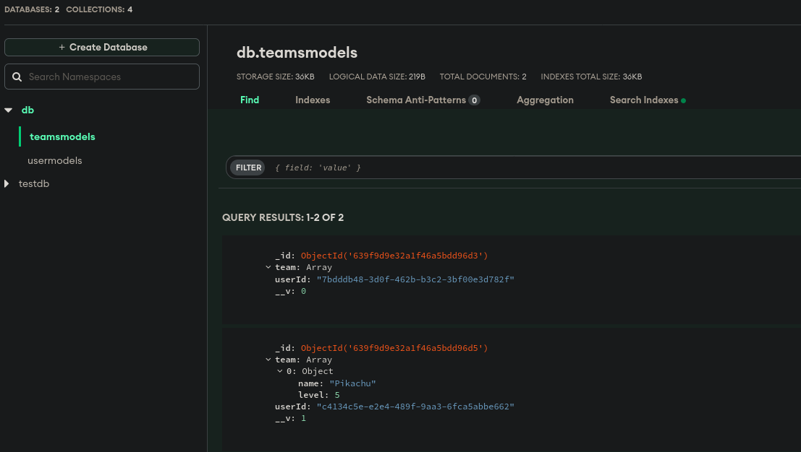

# Pokemon API
API to manage our pokemon team using Express & MongoDB database to store our data.

### 👨‍💻 **MEN Stack**

- **M**ongoDB
- **E**xpress
- **N**odeJS

# 🔨Actions to do
- Identify ourselves
- Add Pokemon to our team
- Remove Pokemon from our team
- Switch Pokemon order on our team
- See our team

# 📄REST API Design
- Credentials System
- Add Pokemon to out team (POST /team/pokemon)
- Remove Pokemon from our team (DELETE /team/pokemon/:id)
- Switch Pokemon order on our team (PUT /team)
- See our team (GET /team)
- Authentication (POST /auth/login)

---

- **Express** to create the server _npm install express_

- **Mocha and Chai** for testing _npm install -D mocha chai_ then modify package.json to add the following scripts:
```json
"scripts": {
    "test": "NODE_ENV=test ./node_modules/.bin/mocha **/**/*.test.js"

  }
``` 
- **bcrypt** to encrypt the password _npm install bcrypt_

- **uuid** to generate unique ids _npm install uuid_

- **Passport** for authentication in JWT _npm install passport passport-local passport-http-bearer_ use [jwt debugger](jwt.io/#debugger-io) to debug the token and see the payload

- **Mongoose** for MongoDB _npm install mongoose_ and _npm install -D @types/mongoose_ to use typescript

- **Body-parser** to parse the body of the request _npm install body-parser_

- **Axios** to make http requests _npm install axios_

---

Use [Postman Desktop](https://www.getpostman.com/) to test the API

Or use **_curl_** in the terminal

---
## 🔮Installation
```
npm install
```
### Run
```
npm start
```
### Test
```
npm run test
```
### Execute production server
```
node app.js
```

---

## 📚Documentation
- [Express](https://expressjs.com/)
- [Mocha](https://mochajs.org/)
- [Chai](https://www.chaijs.com/)
- [bcrypt](https://www.npmjs.com/package/bcrypt)
- [uuid](https://www.npmjs.com/package/uuid)
- [Passport](http://www.passportjs.org/)
- [Mongoose](https://mongoosejs.com/)
- [Body-parser](https://www.npmjs.com/package/body-parser)
- [Axios](https://www.npmjs.com/package/axios)
- [Postman Desktop](https://www.getpostman.com/)
- [jwt debugger](jwt.io/#debugger-io)
- [curl](https://curl.haxx.se/)
- [MongoDB](https://www.mongodb.com/)
- [NodeJS](https://nodejs.org/en/)

---

## 📨 MongoDBAtlas example


---

## 👨‍🏭TODO
- [ ] Add a Frontend (React, ME**R**N Stack)
- [ ] Add a Dockerfile to run the app in a container
- [ ] Add a docker-compose.yml to run the app with a MongoDB container
- [ ] Add a CI/CD pipeline

---

## 📝License
This project is under the MIT license. See the [LICENSE](LICENSE) file for more details.